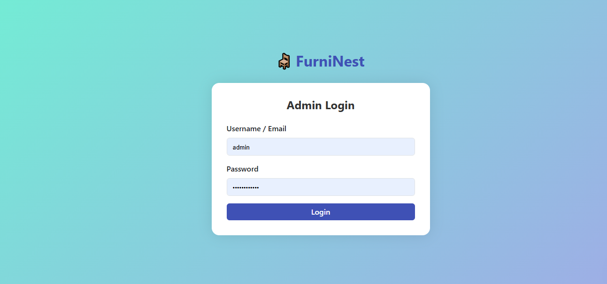
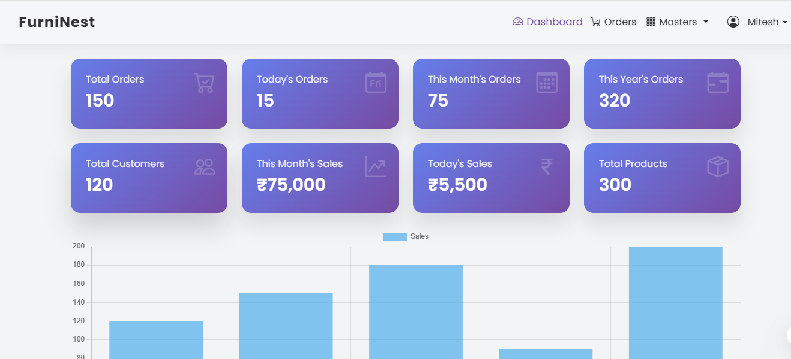

# Furni_Nest_Web
# 🪑 FurniNest Admin Panel

A sleek and powerful PHP-based admin dashboard designed for managing your furniture e-commerce website with ease and efficiency.


---

## ✨ Features

- 🔐 Secure Admin Login with Password Hashing
- 🧑‍💼 User Management (Create, Edit, Delete)
- 📦 Product Master Setup
- 📂 Category & Subcategory Management
- 🖼️ Image Upload Support
- 📊 Clean, Responsive UI with Bootstrap 5
- 🎯 Easy Integration & Customization

---

## 🚀 Tech Stack

- **Frontend**: HTML5, CSS3, Bootstrap 5
- **Backend**: PHP 7+, MySQLi
- **Database**: MySQL
- **Auth**: PHP Session + Password Hashing
- **Server**: Apache (XAMPP/WAMP/LAMP supported)

---

## 📸 Screenshots

| Login Page | Dashboard |
|------------|-----------|
|  |  |

> 💡 Tip: Add your screenshots inside a `screenshots/` folder.

---

## 🛠️ Installation

1. Clone the repo:
   ```bash
   git clone https://github.com/CodeMasterMitesh/Furni_Nest_Web.git
   cd Furni_Nest_Web

📁 Folder Structure
furninest/
├── admin/
│   ├── login.php
│   ├── dashboard.php
│   ├── masters/
│   ├── users/
│   └── partition/
├── config/
│   └── conn.php
├── css/
├── js/
├── uploads/
├── .htaccess
└── index.php


🔐 Default Admin Credentials
Username: admin@example.com
Password: admin123

🤝 Contributing
Contributions are welcome! Feel free to submit issues, fork the repo, and create pull requests.

📄 License
This project is open-source and available under the MIT License.


🙌 Author

Built with ❤️ by Mitesh Prajapati
📧 Email: info@codemastermitesh.com
🌐 Website: codemastermitesh.com

⭐️ Show Your Support
If you like this project, please give it a ⭐️ on GitHub!

